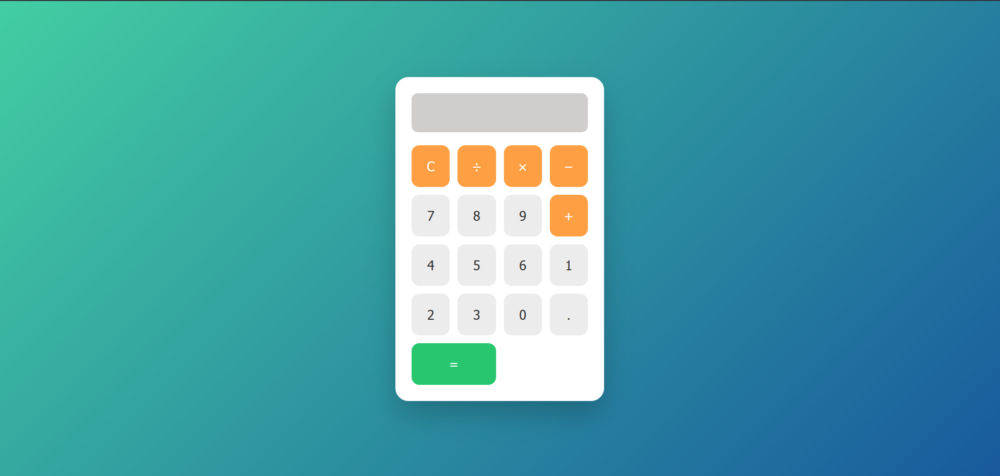

# 🔢 Simple Calculator App

This is a simple and responsive calculator web application built using **HTML**, **CSS**, and **JavaScript**. It allows users to perform basic arithmetic operations like addition, subtraction, multiplication, and division.

---


## 📌 Features

- Clean and user-friendly interface
- Responsive layout for all devices
- Supports: `+`, `-`, `*`, `/`, `.`
- Clear (`C`) and Equal (`=`) functions
- Built with pure HTML, CSS, and JavaScript

---

## 🛠️ Tech Stack

- HTML
- CSS
- JavaScript

---

## 🚀 Getting Started

### 1. Clone the repository
```bash
git clone https://github.com/shivani5295/calculator-project.git
